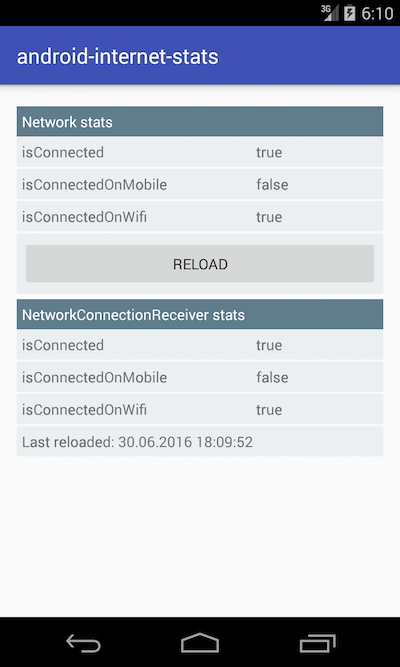

Android internet stats - example
================================================
Here is a very simple example how to prepare a mechanism for checking internet connection. It allows to detect if device has internet connection and of connection as well (Mobile or Wifi).

Goals
--------
The example application has the following goals:

- Check if device has internet connection
- Detect connection type (Mobile or Wifi)
- Handle system event when internet connection has changed

Solution
---------
- Example mostly based on the [ConnectivityManager](https://developer.android.com/reference/android/net/ConnectivityManager.html) which allows get state of network connectivity
- Register the [BroadcastReceiver](https://developer.android.com/reference/android/content/BroadcastReceiver.html) on action: ```<action android:name="android.net.conn.CONNECTIVITY_CHANGE"/>``` for handle any change of connectivity

Screen
---------

